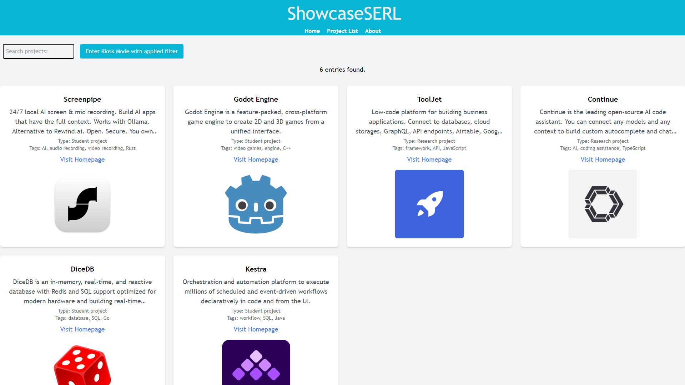

# ShowcaseSERL

## Introduction

ShowcaseSERL is a public portfolio that displays student-and researcher made projects, mainly made for finished projects to inspire students to contribute their own projects. ShowcaseSERL serves two primary purposes; a web application for browsing projects, as well as a kiosk display to display certain projects in a public setting.



## How to Use

### Prerequisites

First, ensure that you have Node.js installed.

All necessary dependencies can be installed with the following command:
```bash
npm install
``` 

### Build

To build the project in its entirety, run the following command:
```bash
npm run build
```

### Run

First, run the commands listed in the "Prerequisites" and "Build" pragraphs. Then, run the development server:
```bash
npm run dev
```
## License

MIT License

Copyright © 2024 Samuel Stenfelt

Permission is hereby granted, free of charge, to any person obtaining a copy
of this software and associated documentation files (the "Software"), to deal
in the Software without restriction, including without limitation the rights
to use, copy, modify, merge, publish, distribute, sublicense, and/or sell
copies of the Software, and to permit persons to whom the Software is
furnished to do so, subject to the following conditions:

The above copyright notice and this permission notice shall be included in all
copies or substantial portions of the Software.

THE SOFTWARE IS PROVIDED "AS IS", WITHOUT WARRANTY OF ANY KIND, EXPRESS OR
IMPLIED, INCLUDING BUT NOT LIMITED TO THE WARRANTIES OF MERCHANTABILITY,
FITNESS FOR A PARTICULAR PURPOSE AND NONINFRINGEMENT. IN NO EVENT SHALL THE
AUTHORS OR COPYRIGHT HOLDERS BE LIABLE FOR ANY CLAIM, DAMAGES OR OTHER
LIABILITY, WHETHER IN AN ACTION OF CONTRACT, TORT OR OTHERWISE, ARISING FROM,
OUT OF OR IN CONNECTION WITH THE SOFTWARE OR THE USE OR OTHER DEALINGS IN THE
SOFTWARE.